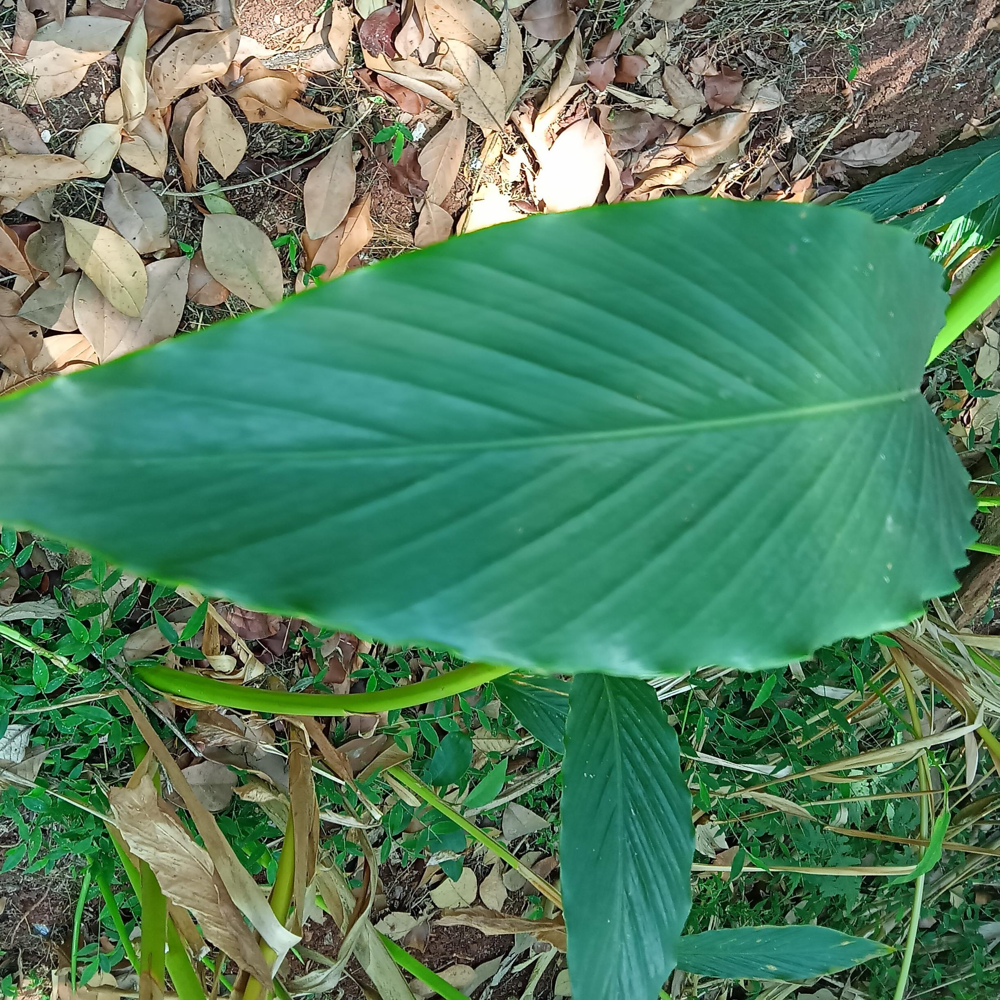
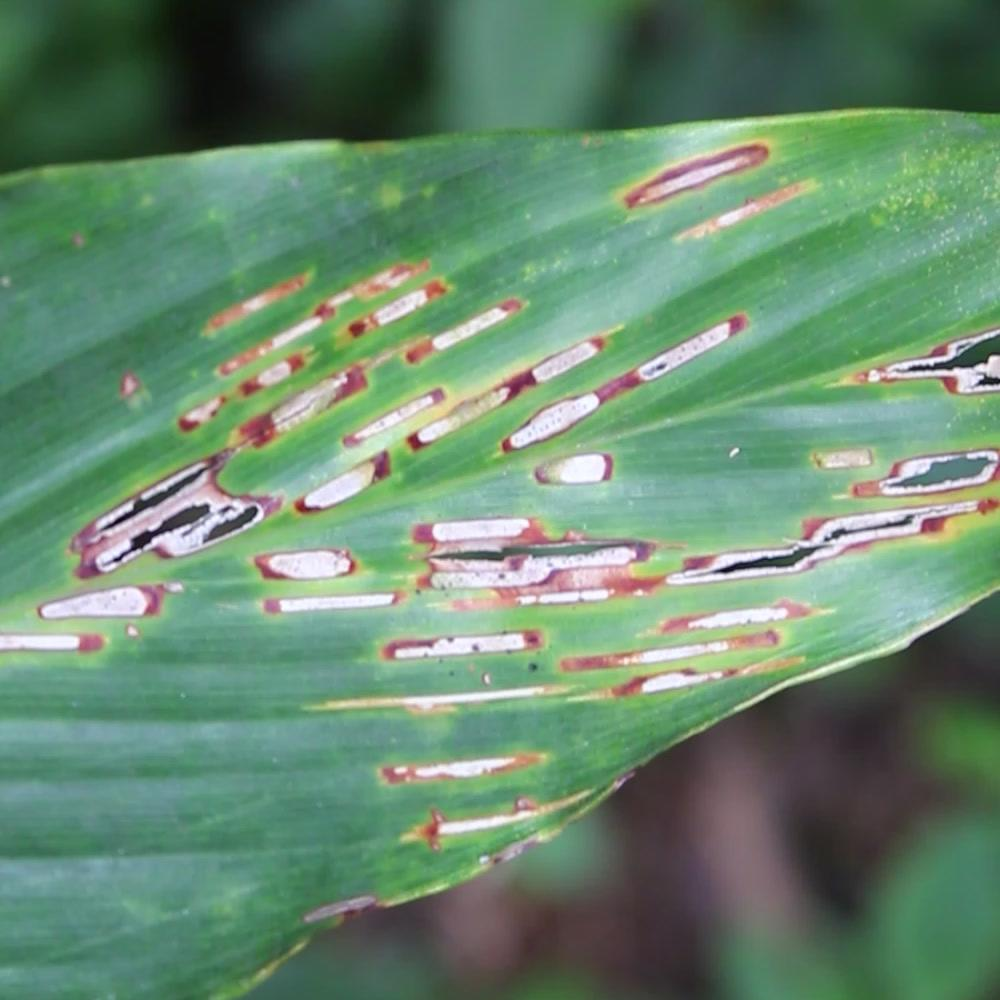
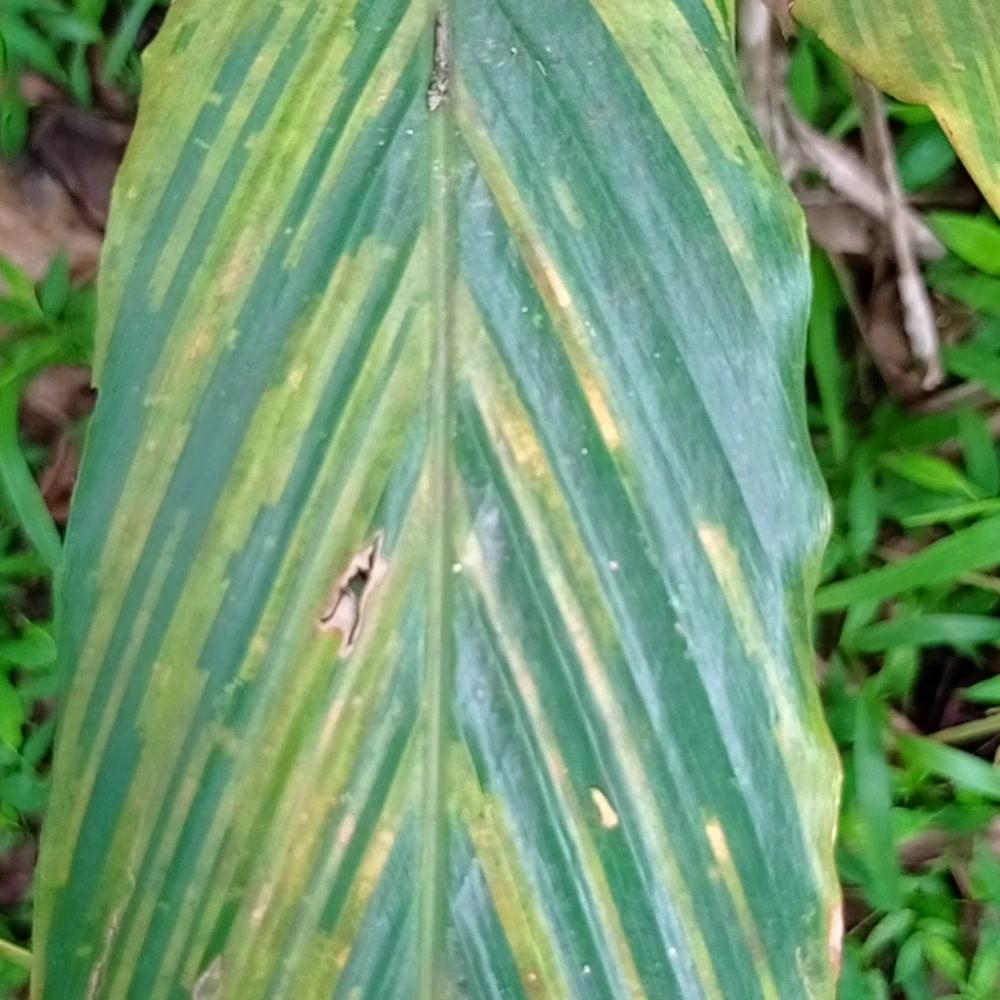
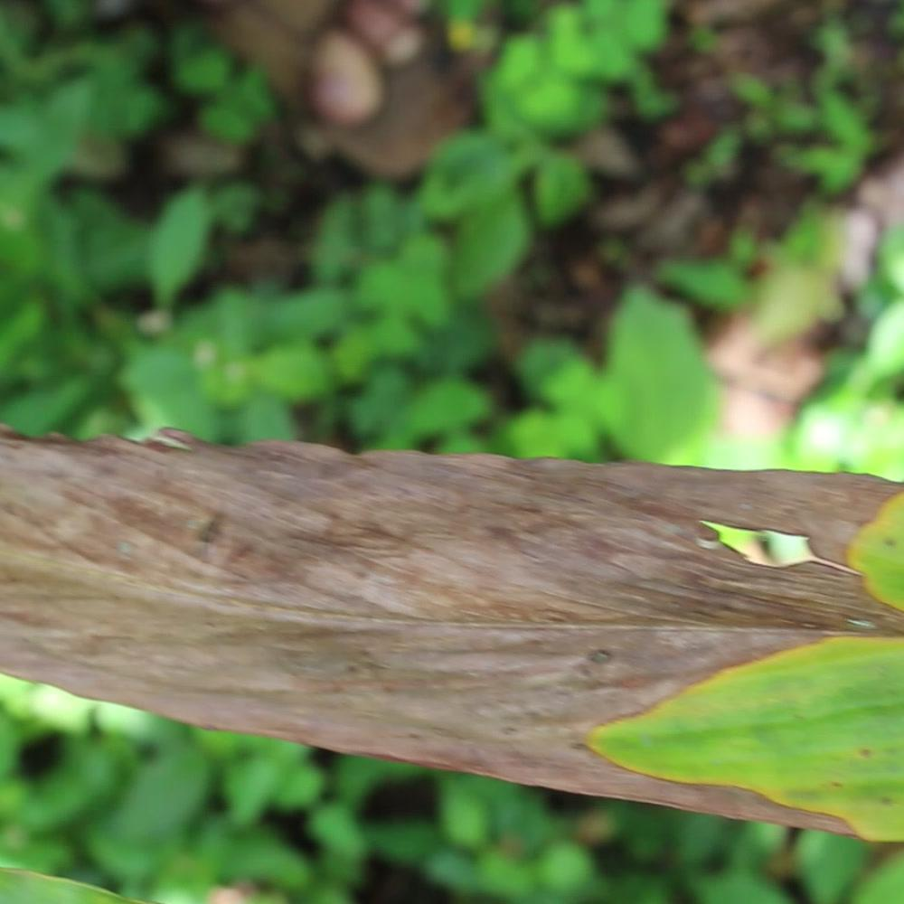

# Cardamom Disease Classification

## Overview

Cardamom Disease Classification is a deep learning-based project developed by our team to detect diseases in cardamom plants using image data. We leverage transfer learning by using the MobileNetV2 model — a lightweight yet powerful convolutional neural network — as the base model. Our system is trained on a curated cardamom disease dataset to accurately classify leaf diseases and help farmers take timely action.

---

## Features

- **Transfer Learning with MobileNetV2**  
  Utilizes MobileNetV2 as the base architecture for efficient and accurate disease detection.

- **Disease Detection**<br>
** Healthy Leaf **

** Aphid Disease **

** Phyllosticta Disease **

** Dry-Rot Disease **



- **Lightweight & Efficient**  
  The model is optimized for deployment on resource-constrained devices without compromising accuracy.

- **Custom Dataset**  
  Trained on a domain-specific dataset of cardamom leaf images, capturing various disease states and healthy samples.

---

## Dataset

The dataset contains high-quality images of cardamom leaves labeled according to the disease type or healthy condition. It covers diverse scenarios and disease severity to ensure robust model performance.

---

## Installation & Usage

Clone the repository:

```bash
git clone https://github.com/yourusername/cardamom_disease_classification.git
cd cardamom_disease_classification
```

## Contributors

- **S U Tejas** - [GitHub](https://github.com/tejas-su)

